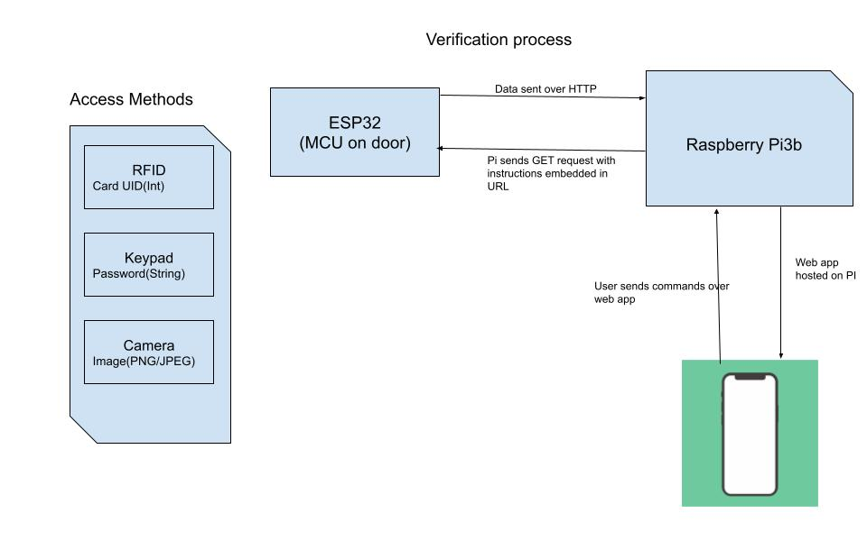

# Web Interface To Embedded system

## Setting Up Environment
### Tech Stacks
React 
Flask 
SQlite(3)
### Frontend
<strong>Prerequisites</strong>: Node.js, npm/npx/yarn

Navigate to the `frontend/` directory

Run `npm install`

## Backend
<strong>Prerequisites</strong>: python, pip

Run:

`pip install -r requirements.txt` 
`flask run`

## Database
<strong>Prerequisites</strong>: sqlite(3)

To open database run

` sqlite3 door.db `